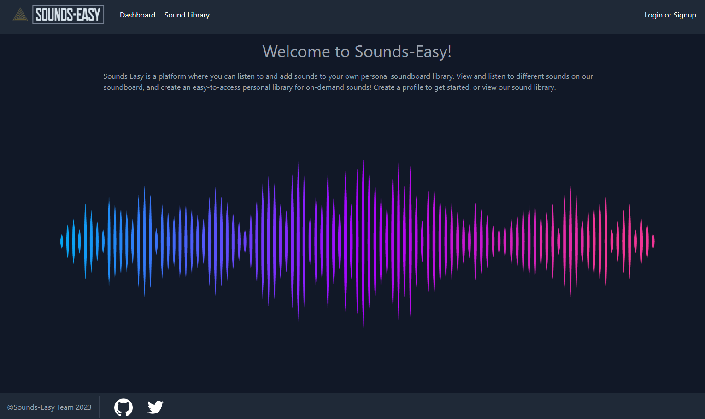

# Sounds Easy

## Description
A free online soundboard for cheapskates.

## Table of Contents 
- [Sounds Easy](#sounds-easy)
  - [Description](#description)
  - [Table of Contents](#table-of-contents)
  - [Screenshot](#screenshot)
  - [Usage](#usage)
  - [Team](#team)
  - [Questions](#questions)
  - [How to Contribute](#how-to-contribute)
  - [Tests](#tests)
  - [Credits](#credits)
  - [License](#license)

## Screenshot

## Usage
Go to the website and sign-up or use the Sound Library to check out some audio clips.

## Team

[Leland Johnson](https://github.com/eljayman)
[Ethan Gayton](https://github.com/ethikry)
[Luka Perez](https://github.com/lukaperez)

## Questions

If you have any questions about this application send an email or message on github.

## How to Contribute
If you would like to contribute to this project, please contact us through github.com

## Tests
If you find any errors in this application, please contact us through github.com

## Credits

This application was built in [node.js](https://nodejs.org/) and used [create-react-app](https://reactjs.org/) as a [JavaScript](https://www.javascript.com/) library, [Express](expressjs.com) as a server, [Apollo Server and Client](https://www.apollographql.com/) as an API server-client interface, [MongoDB Atlas](https://www.mongodb.com/cloud/atlas) for remote database hosting, [Mongoose](https://mongoosejs.com/) as an ODM, [bcrypt](https://www.npmjs.com/package/bcrypt) for encryption, [dotenv](https://www.npmjs.com/package/dotenv) to handle environment variables, [graphQL](https://graphql.org/) to create the API, [JWT](https://jwt.io/) for user validation, [Tailwind CSS](https://tailwindcss.com/) for styling, [concurrently](https://www.npmjs.com/package/concurrently) to run server-client syncronously, and [nodemon](https://www.npmjs.com/package/nodemon) for reloads on demand, as dependencies.

## License

    Copyright 2022 eljayman

Permission is hereby granted, free of charge, to any person obtaining a copy of this software and associated documentation files (the "Software"), to deal in the Software without restriction, including without limitation the rights to use, copy, modify, merge, publish, distribute, sublicense, and/or sell copies of the Software, and to permit persons to whom the Software is furnished to do so, subject to the following conditions:

The above copyright notice and this permission notice shall be included in all copies or substantial portions of the Software.

THE SOFTWARE IS PROVIDED "AS IS", WITHOUT WARRANTY OF ANY KIND, EXPRESS OR IMPLIED, INCLUDING BUT NOT LIMITED TO THE WARRANTIES OF MERCHANTABILITY, FITNESS FOR A PARTICULAR PURPOSE AND NONINFRINGEMENT. IN NO EVENT SHALL THE AUTHORS OR COPYRIGHT HOLDERS BE LIABLE FOR ANY CLAIM, DAMAGES OR OTHER LIABILITY, WHETHER IN AN ACTION OF CONTRACT, TORT OR OTHERWISE, ARISING FROM, OUT OF OR IN CONNECTION WITH THE SOFTWARE OR THE USE OR OTHER DEALINGS IN THE SOFTWARE.
    

  